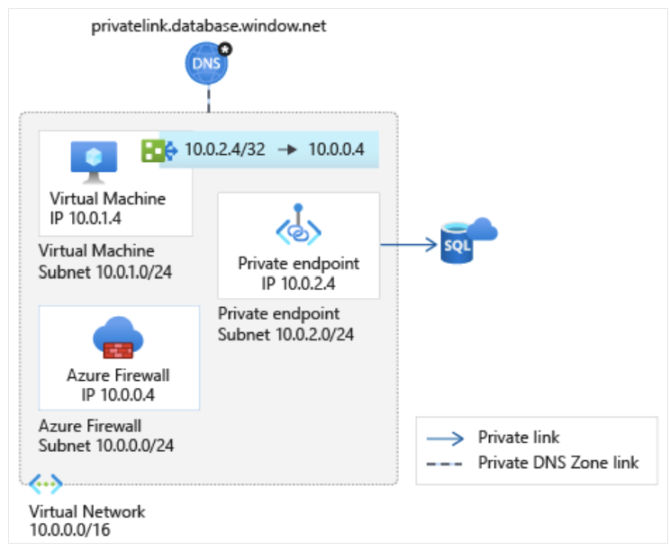

# Secure your application in a hub and spoke topology!

# Introduction	

Azure Private Link enables you to access Azure PaaS Services (for example, Azure Storage and SQL Database) and Azure hosted customer-owned/partner services over a private endpoint in your virtual network.

Traffic between your virtual network and the service travels the Microsoft backbone network. Exposing your service to the public internet is no longer necessary.
Access to the private endpoint through virtual network peering and on-premises network connections extend the connectivity.

You may need to inspect or block traffic from clients to the services exposed via private endpoints. Complete this inspection by using Azure Firewall or a third-party network virtual appliance.

The following limitations apply:
- Network security groups (NSG) are bypassed by traffic coming from private endpoints
- User-defined routes (UDR) are bypassed by traffic coming from private endpoints. User-defined routes can be used to override 	traffic destined for the private endpoint.
- A single route table can be attached to a subnet
- A route table supports up to 400 routes

Azure Firewall filters traffic using either:
- FQDN in network rules for TCP and UDP protocols
- FQDN in application rules for HTTP, HTTPS, and MSSQL.
 

**Important**
The use of application rules over network rules is recommended when inspecting traffic destined to private endpoints in order to maintain flow symmetry. If network rules are used, or an NVA is used instead of Azure Firewall, SNAT must be configured for traffic destined to private endpoints.

**Notes**
1. SQL FQDN filtering is supported in proxy-mode only (port 1433). Proxy mode can result in more latency compared to redirect. If you want to continue using redirect mode, which is the default for clients connecting within Azure, you can filter access using FQDN in firewall network rules.
2. If you want to secure traffic to private endpoints in Azure Virtual WAN using secured virtual hub, see Secure traffic destined to private endpoints in Azure Virtual WAN.

## Scenario 1: Hub and spoke architecture - Shared virtual network for private endpoints and virtual machines
 
This scenario is implemented when:
- It's not possible to have a dedicated virtual network for the private endpoints
- When only a few services are exposed in the virtual network using private endpoints
The virtual machines will have /32 system routes pointing to each private endpoint. One route per private endpoint is configured to route traffic through Azure Firewall.
The administrative overhead of maintaining the route table increases as services are exposed in the virtual network. The possibility of hitting the route limit also increases.
Depending on your overall architecture, it's possible to run into the 400 routes limit. It's recommended to use scenario 1 whenever possible.
Connections from a client virtual network to the Azure Firewall in a hub virtual network will incur charges if the virtual networks are peered. Connections from Azure Firewall in a hub virtual network to private endpoints in a peered virtual network are not charged.

 
 
 
For more information on charges related to connections with peered virtual networks, see the FAQ section of the pricing page.

## Scenario 2: Single virtual network
 
Use this pattern when a migration to a hub and spoke architecture isn't possible. The same considerations as in scenario 2 apply. In this scenario, virtual network peering charges don't apply.

 
## Scenario 3: On-premises traffic to private endpoints
 
This architecture can be implemented if you have configured connectivity with your on-premises network using either:
- ExpressRoute
- Site to Site VPN
If your security requirements require client traffic to services exposed via private endpoints to be routed through a security appliance, deploy this scenario.
The same considerations as in scenario 1 above apply. In this scenario, there aren't virtual network peering charges. For more information about how to configure your DNS servers to allow on-premises workloads to access private endpoints, see On-Premises workloads using a DNS forwarder.

 
## Scenario 4: Hub and spoke architecture - Dedicated virtual network for private endpoints
 
This scenario is the most expandable architecture to connect privately to multiple Azure services using private endpoints. A route pointing to the network address space where the private endpoints are deployed is created. This configuration reduces administrative overhead and prevents running into the limit of 400 routes.

Connections from a client virtual network to the Azure Firewall in a hub virtual network will incur charges if the virtual networks are peered. Connections from Azure Firewall in a hub virtual network to private endpoints in a peered virtual network are not charged.

# LAB :
In this Lab you will deploy Scenario 4 with a Hub and spoke topology. You’ll create three virtual networks and their corresponding subnets to:
- Contain the Azure Firewall used to restrict communication between the VM and the private endpoint.
- Host the VM that is used to access your private link resource.
- Host the private endpoint.

## Prerequisites:

- An Azure subscription.
- A Log Analytics workspace.

See, Create a Log Analytics workspace in the Azure portal to create a workspace if you don't have one in your subscription.

## Exercice 1: Create a VM & networks

### Task 1: Create resources
In this section, you'll create a virtual network and subnet to host the VM used to access your private link resource. An Azure SQL database is used later as the example service.

We will be using an Azure CLI script to deploy the networks and the VM:
  
  1.	Download the script here: https://aka.ms/AzureNetworksLab
  2.	Login to the portal & launch the cloud shell:
 
  
 
 3.	List your subscriptions : `az account list –o table`
 4.	Set the right the subscription if needed: `az account set ––subscription {id}`
 5.	Upload the script via Azure portal
 6.	Move the script under the clouddrive: `mv  1-1-Create-Network.sh  clouddrive/`
 7.	Go to the clouddrive:  `cd clouddrive`
 8.	Launch the script:  `./1-1-Create-Network.sh`

### Task 2: Check the deployment

You should have a resource group myResourceGroup, three networks, a VM and an Azure Bastion with following parameters: 

**Azure Firewall network**

| Parameter	 | Value |
|------------| ------|
| Virtual network name |	myAzFwVNet |
| Region name |	North Europe |
| IPv4 address space |	10.0.0.0/16|
| Subnet name 	|AzureFirewallSubnet|
| Subnet address range>	|10.0.0.0/24|

**Virtual machine network**

| Parameter	 | Value |
|------------| ------|
| Virtual network name |	myVMVNet |
| Region name |	North Europe |
| IPv4 address space |	10.1.0.0/16|
| Subnet name 	|VMSubnet|
| Subnet address range>	|10.1.0.0/24|

**Private endpoint network**

| Parameter	 | Value |
|------------| ------|
| Virtual network name |	myPEVNet |
| Region name |	North Europe |
| IPv4 address space |	10.2.0.0/16|
| Subnet name 	|PrivateEndpointSubnet|
| Subnet address range>	|10.2.0.0/24|

**Virtual machine**

| Parameter	 | Value |
|------------| ------|
| Virtual machine name |	myVM|
| Region name |	North Europe |
| Image |	Ubuntu Server 18.04 LTS - Gen1|
| Size 	|Standard_B2s|

**Azure Bastion**

| Parameter	 | Value |
|------------| ------|
| Name |	MyBastion|
| Region name |	North Europe |
| Public ip adress |	BastionPublicIpAddress|
| Virtual network/subnet| myVMVNet/AzureBastionSubnet|

**About outbound access for Azure VMs**

The default outbound access IP mechanism provides an outbound IP address that isn't configurable. Azure provides a default outbound access IP for VMs that:
- Aren't assigned a public IP address 
- Are in the back-end pool of an internal basic Azure load balancer. 

The default outbound access IP is disabled when:
- A public IP address is assigned to the VM
- The VM is placed in the back-end pool of a standard load balancer (with or without outbound rules)
- An Azure Virtual Network NAT gateway resource is assigned to the subnet of the VM

VMs that are created by virtual machine scale sets in flexible orchestration mode don't have default outbound access.
For more information about outbound connections in Azure, see Default outbound access in Azure and Use source network address translation (SNAT) for outbound connections.

### task 3: Connect the virtual networks using virtual network peering

In this section, we'll connect virtual networks myVMVNet and myPEVNet to myAzFwVNet using peering in a hub and spoke topology. There won't be direct connectivity between myVMVNet and myPEVNet. 

1.	In the portal's search bar, enter myAzFwVNet.
2.	Select Peerings under Settings menu and select + Add.
3.	In Add Peering enter or select the following information:

 ----->  

4.	Select OK.
5.	Repeat the same steps for the peering with the virtual network myPEVNet

## Exercice 2: Deploy Azure Firewall

### Task 1: Create the resource
1.	On the Azure portal menu or from the Home page, select Create a resource.
2.	Type firewall in the search box and press Enter.
3.	Select Firewall and then select Create.
4.	On the Create a Firewall page, use the following table to configure the firewall:
 
 
 
5.	Select Review + create. You're taken to the Review + create page where Azure validates your configuration.
6.	When you see the Validation passed message, select Create.

### Task 2: Enable firewall logs

In this section, you enable the logs on the firewall.

1.	In the Azure portal, select All resources in the left-hand menu.
2.	Select the firewall **myAzureFirewall** in the list of resources.
3.	Under Monitoring in the firewall settings, select Diagnostic settings
4.	Select + Add diagnostic setting in the Diagnostic settings.
5.	In Diagnostics setting, enter or select this information:

 
 
 6.	Select Save.
 
## Exercice 3: Create Azure SQL database with a private endpoint

### Task 1: Create the SQL Database 

1.	On the upper-left side of the screen in the Azure portal, select Create a resource > Databases > SQL Database.
2.	In Create SQL Database - Basics, enter or select this information:
3.	
        
  
3.	In the Networking tab leave the default configuration
4.	In the Security tab, leave the default configuration except for the following:

| Setting	 | Value |
|------------| ------| 
|Enable Microsoft Defender for SQL	|Not Now|

5.	Select Review + create. You're taken to the Review + create page where Azure validates your configuration.
6.	When you see the Validation passed message, select Create.

### Task 2: Create a private endpoint for your database

In this section, you create a private endpoint for the Azure SQL database in the previous section.
1.	In the Azure portal, select All resources in the left-hand menu.
2.	Select the Azure SQL server mydbserver1 in the list of services. If you used a different server name, choose that name.
3.	In the server Security settings, select Networking , Private access then Create Private endpoint 
4.	In Create a private endpoint, enter or select this information in the Basics & resource tabs:

  --->   
 

5. Enter or select this information in the Network & DNS tabs: 

   --->    
 
6.	Select the Review + create tab or select Review + create at the bottom of the page.
7.	Select Create.

### Task 3: Link the virtual networks to the private DNS zone

In this section, we'll link virtual networks myVMVNet and myAzFwVNet to the privatelink.database.windows.net private DNS zone. This zone was created when we created the private endpoint.
The link is required for the VM and firewall to resolve the FQDN of database to its private endpoint address. Virtual network myPEVNet was automatically linked when the private endpoint was created.

Note
If you don't link the VM and firewall virtual networks to the private DNS zone, both the VM and firewall will still be able to resolve the SQL Server FQDN. They will resolve to its public IP address.

1.	In the portal's search bar, enter privatelink.database.
2.	Select **privatelink.database.windows.net** in the search results.
3.	Select Virtual network links under Settings.
4.	Select + Add
5.	In Add virtual network link enter or select the following information:

    

6.	Select OK.
7.	Repeat the same steps for **myAzFwVNet** virtual network.

## Exercice 4 : Configure the connectivity through Azure Firewall

### Task 1: Configure an application rule with SQL FQDN in Azure Firewall

In this section, configure an application rule to allow communication between myVM and the private endpoint for SQL Server mydbserver1.database.windows.net.
This rule allows communication through the firewall that we created in the previous steps.
1.	In the portal's search bar, enter Firewall Policies.
2.	Select **myFirewall-policy** 
3.	Select the Application rules tab.
4.	Select + Add application rule collection.
5.	In Add application rule collection enter or select the following information:

| Setting	 | Value |
|------------| ------| 
|Name|SQLPrivateEndpoint|
|Priority|100|
|Action|Allow|
|Rules| |
|Name|SQLPrivateEndpoint|
|Source type|Leave the default IP address|
|Source|10.1.0.0/16|
|Destination type|FQDN|
|Target FQDNs|mydbserver1.database.windows.net|
|Protocol: Port|mssql:1433|
	 
 

	
6.	Select Add.

### Task 2: Route traffic between the virtual machine and private endpoint through Azure Firewall

We didn't create a virtual network peering directly between virtual networks myVMVNet and myPEVNet. The virtual machine myVM doesn't have a route to the private endpoint we created. 
In this section, we'll create a route table with a custom route. The route sends traffic from the myVM subnet to the address space of virtual network myPEVNet, through the Azure Firewall.
1.	On the Azure portal menu or from the Home page, select Create a resource.
2.	Type route table in the search box and press Enter.
3.	Select Route table and then select Create.
4.	On the Create Route table page, use the following table to configure the route table:

Setting	Value
Project details	
Subscription	Select your subscription.
Resource group	Select myResourceGroup.
Instance details	
Region	Select North Europe.
Name	Enter VMsubnet-to-AzureFirewall.
Propagate gateway routes	Select No.
5.	Select Review + create. You're taken to the Review + create page where Azure validates your configuration.
6.	When you see the Validation passed message, select Create.
7.	Once the deployment completes select Go to resource.
8.	Select Routes under Settings.
9.	Select + Add.
10.	On the Add route page, enter, or select this information:
Setting	Value
Route name	Enter myVMsubnet-to-privateendpoint.
Address prefix	Enter 10.2.0.0/16.
Next hop type	Select Virtual appliance.
Next hop address	Enter 10.0.0.4.
11.	Select OK.
12.	Select Subnets under Settings.
13.	Select + Associate.
14.	On the Associate subnet page, enter or select this information:
Setting	Value
Virtual network	Select myVMVNet.
Subnet	Select VMSubnet.
15.	Select OK.

 

## Exercice 5: Test the connectivity

### Task 1: Connect to the virtual machine from your client computer

