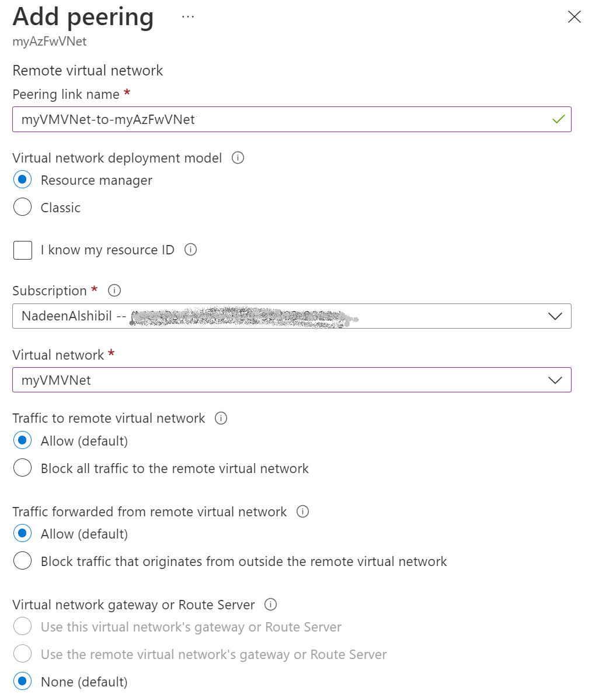
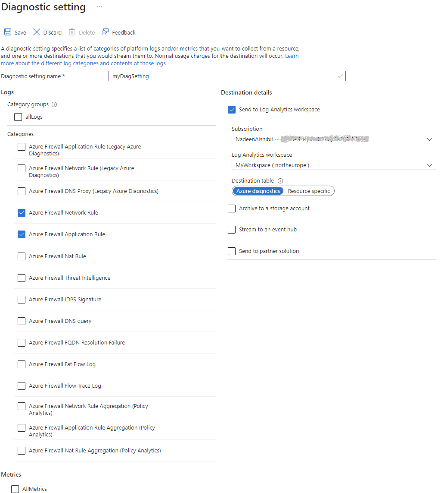

# Secure your application in a hub and spoke topology!


# Introduction	

Azure Private Link enables you to access Azure PaaS Services (for example, Azure Storage and SQL Database) and Azure hosted customer-owned/partner services over a [private endpoint](https://learn.microsoft.com/en-us/azure/private-link/private-endpoint-overview) in your virtual network.

Traffic between your virtual network and the service travels the Microsoft backbone network. Exposing your service to the public internet is no longer necessary.
Access to the private endpoint through virtual network peering and on-premises network connections extend the connectivity.

You may need to inspect or block traffic from clients to the services exposed via private endpoints. Complete this inspection by using [Azure Firewall](https://learn.microsoft.com/en-us/azure/firewall/overview) or a third-party network virtual appliance.

The following limitations apply with Private Endpoints:
- Private Endpoint supports **TCP** and **UDP** traffic only. See [Private Endpoint FAQ](https://learn.microsoft.com/en-us/azure/private-link/private-link-faq#do-private-endpoints-support-icmp-traffic-)
- Private Endpoint do not support **NSG flow logs**. It means that Traffic Analysis do not work. See [Doc](https://learn.microsoft.com/en-us/azure/network-watcher/network-watcher-nsg-flow-logging-overview#traffic-across-a-private-link).
- Private endpoint automatically creates a **/32 route** propagated to the VNet it resides in and other peered VNets. [Details](https://msandbu.org/private-endpoints-snat-udr-and-azure-firewall/).
- Network security groups (NSG) are bypassed by traffic coming from private endpoints
- User-defined routes (UDR) are bypassed by traffic coming from private endpoints. User-defined routes can be used to override 	traffic destined for the private endpoint.
- A single route table can be attached to a subnet
- A route table supports up to 400 routes

Azure Firewall filters traffic using either:
- [FQDN in network rules](https://learn.microsoft.com/en-us/azure/firewall/fqdn-filtering-network-rules) for TCP and UDP protocols
- [FQDN in application rules](https://learn.microsoft.com/en-us/azure/firewall/features#application-fqdn-filtering-rules) for HTTP, HTTPS, and MSSQL.

 

**Important**
The use of application rules over network rules is recommended when inspecting traffic destined to private endpoints in order to maintain flow symmetry. If network rules are used (because other protocols than HTTP, HTTPS and MSSQL are needed), SNAT must be configured for traffic destined to private endpoints. To do so, configure Private IP ranges (SNAT) in Azure Firewall Policy to include Private Endpoints vnet in addresses that require SNAT. SNAT is also needed if an NVA is used instead of Azure Firewall.

**Notes**
1. SQL FQDN filtering is supported in proxy-mode only (port 1433). [Proxy mode](https://learn.microsoft.com/en-us/azure/azure-sql/database/connectivity-architecture#connection-policy) can result in more latency compared to redirect. If you want to continue using redirect mode, which is the default for clients connecting within Azure, you can filter access using FQDN in firewall network rules.
2. If you want to secure traffic to private endpoints in Azure Virtual WAN using secured virtual hub, see [Secure traffic destined to private endpoints in Azure Virtual WAN](https://learn.microsoft.com/en-us/azure/firewall-manager/private-link-inspection-secure-virtual-hub).


## Scenario 1: Single virtual network


Use this pattern when a migration to a hub and spoke architecture isn't possible. 
The VMs will have /32 system routes pointing to each private endpoint. One route per private endpoint is configured to route traffic through Azure Firewall.

The administrative overhead of maintaining the route table increases as services are exposed in the virtual network. The possibility of hitting the route limit also increases.Depending on your overall architecture, it's possible to run into the 400 routes limit. It's recommended to use **scenario 4** whenever possible.

In this scenario, virtual network peering charges **don't apply.

## Scenario 2: Hub and spoke architecture - Shared virtual network for private endpoints and virtual machines

 
 
This scenario is implemented when:
•	It's not possible to have a dedicated virtual network for the private endpoints
•	When only a few services are exposed in the virtual network using private endpoints

The same considerations as in scenario 1 apply ! 

Connections from a client virtual network to the Azure Firewall in a hub virtual network will incur charges if the virtual networks are peered. wheras connections from Azure Firewall in a hub virtual network to private endpoints in a peered virtual network **are not charged.

For more information on charges related to connections with peered virtual networks, see the FAQ section of the [pricing page](https://azure.microsoft.com/pricing/details/private-link/).


## Scenario 3: On-premises traffic to private endpoints


This architecture can be implemented if you have configured connectivity with your on-premises network using either:

- [ExpressRoute](https://learn.microsoft.com/en-us/azure/expressroute/expressroute-introduction)
- [Site to Site VPN](https://learn.microsoft.com/en-us/azure/vpn-gateway/tutorial-site-to-site-portal)

If your security requirements require client traffic to services exposed via private endpoints to be routed through a security appliance, deploy this scenario.
The same considerations as in scenario 1 above apply. 

In this scenario, there aren't virtual network peering charges. For more information about how to configure your DNS servers to allow on-premises workloads to access private endpoints, see [On-Premises workloads using a DNS forwarder](https://learn.microsoft.com/en-us/azure/private-link/private-endpoint-dns#on-premises-workloads-using-a-dns-forwarder).


 
## Scenario 4: Hub and spoke architecture - Dedicated virtual network for private endpoints
 
This scenario is the most expandable architecture to connect privately to multiple Azure services using private endpoints. A route pointing to the network address space where the private endpoints are deployed is created. This configuration reduces administrative overhead and prevents running into the limit of 400 routes.

Connections from a client virtual network to the Azure Firewall in a hub virtual network will incur charges if the virtual networks are peered. Connections from Azure Firewall in a hub virtual network to private endpoints in a peered virtual network are not charged.


For more information on charges related to connections with peered virtual networks, see the FAQ section of the [pricing page](https://azure.microsoft.com/pricing/details/private-link/).

# LAB :
In this Lab you will deploy Scenario 4 with a Hub and spoke topology. You’ll create three virtual networks and their corresponding subnets to:
- Contain the Azure Firewall used to restrict communication between the VM and the private endpoint.
- Host the VM that is used to access your private link resource.
- Host the private endpoint.

## Prerequisites:

- An Azure subscription.
- A Log Analytics workspace.

See, [Create a Log Analytics workspace in the Azure portal](https://learn.microsoft.com/en-us/azure/azure-monitor/logs/quick-create-workspace) to create a workspace if you don't have one in your subscription.

## Exercice 1: Create a VM & networks

### Task 1: Create resources

In this section, you'll create a virtual network and subnet to host the VM used to access your private link resource. A bastion is created to allow secure access to the VM. An Azure SQL database is used later as the example service.

We will be using an Azure CLI script to deploy the networks and the VM.

If you prefer to use Terraform to deploy the lab resources go [here !!](https://github.com/nadeenAlshibil/Azure-Networking/blob/main/Terraform/readme.md) 

Otherwise keep reading. 
  
  1.	Download the Lab content:
  
   
 
  3.	Unzip the folder and locate the initial deployment script: **1-1-Initial-Deployment.sh** Under Scripts.
  4.	Login to the portal & launch the cloud shell:
 
  
 
 You can also open a new tab for the shell: https://shell.azure.com
 
 3.	List your subscriptions : `az account list –o table`
 4.	Set the right the subscription if needed: `az account set ––subscription {id}`
 5.	Upload the script via Azure portal:
 
   
 
 7.	Move the script under the clouddrive: `mv  1-1-Initial-Deployment.sh  clouddrive/`
 8.	Go to the clouddrive:  `cd clouddrive`
 9.	Launch the script:  `./1-1-Create-Network.sh`

### Task 2: Check the deployment

1. Go to MyResourceGroupe and check the resources deployed. You should have a resource group myResourceGroup, three networks, a VM and an Azure Bastion with following parameters: 

**Azure Firewall network**

| Parameter	 | Value |
|------------| ------|
| Virtual network name |	myAzFwVNet |
| Region name |	North Europe |
| IPv4 address space |	10.0.0.0/16|
| Subnet name 	|AzureFirewallSubnet|
| Subnet address range>	|10.0.0.0/24|


**Virtual machine network**

| Parameter	 | Value |
|------------| ------|
| Virtual network name |	myVMVNet |
| Region name |	North Europe |
| IPv4 address space |	10.1.0.0/16|
| Subnet name 	|VMSubnet|
| Subnet address range>	|10.1.0.0/24|

**Private endpoint network**

| Parameter	 | Value |
|------------| ------|
| Virtual network name |	myPEVNet |
| Region name |	North Europe |
| IPv4 address space |	10.2.0.0/16|
| Subnet name 	|PrivateEndpointSubnet|
| Subnet address range>	|10.2.0.0/24|


**Virtual machine**

| Parameter	 | Value |
|------------| ------|
| Virtual machine name |	myVM|
| Region name |	North Europe |
| Image |	Ubuntu Server 18.04 LTS - Gen1|
| Size 	|Standard_B2s|


**Azure Bastion**

| Parameter	 | Value |
|------------| ------|
| Name |	MyBastion|
| Region name |	North Europe |
| Public ip adress |	BastionPublicIpAddress|
| Virtual network/subnet| myVMVNet/AzureBastionSubnet|


2. Go to Azure Network Watcher > Topology (Make sure you select the right resource groupe):

 

**About outbound access for Azure VMs**

The default outbound access IP mechanism provides an outbound IP address that isn't configurable. Azure provides a default outbound access IP for VMs that:
- Aren't assigned a public IP address 
- Are in the back-end pool of an internal basic Azure load balancer. 

The default outbound access IP is disabled when:
- A public IP address is assigned to the VM
- The VM is placed in the back-end pool of a standard load balancer (with or without outbound rules)
- An [Azure Virtual Network NAT gateway](https://learn.microsoft.com/en-us/azure/virtual-network/nat-gateway/nat-overview) resource is assigned to the subnet of the VM

VMs that are created by virtual machine scale sets in flexible orchestration mode don't have default outbound access.

For more information about outbound connections in Azure, see [Default outbound access in Azure](https://learn.microsoft.com/en-us/azure/virtual-network/ip-services/default-outbound-access) and [Use source network address translation (SNAT) for outbound connections](https://learn.microsoft.com/en-us/azure/load-balancer/load-balancer-outbound-connections).

### Task 3: Connect the virtual networks using virtual network peering

In this section, we'll connect virtual networks **myVMVNet** and **myPEVNet** to **myAzFwVNet** using peering in a hub and spoke topology. There won't be direct connectivity between **myVMVNet** and **myPEVNet**. 

1.	In the portal's search bar, enter **myAzFwVNet**.
2.	Select Peerings under Settings menu and select + Add.
3.	In Add Peering enter or select the following information:

 ----->  

4.	Select OK.
5.	Repeat the same steps for the peering with the virtual network **myPEVNet**
6.	Check the peering in **Azure Network Watcher > Topology:**

 

## Exercice 2: Deploy Azure Firewall

### Task 1: Create the resource

1.	On the Azure portal menu or from the Home page, select Create a resource.
2.	Type firewall in the search box and press Enter.
3.	Select Firewall and then select Create.
4.	On the Create a Firewall page, use the following table to configure the firewall:
 
 
 
5.	Select Review + create. You're taken to the Review + create page where Azure validates your configuration.
6.	When you see the Validation passed message, select Create.

### Task 2: Enable firewall logs

In this section, you enable the logs on the firewall.

1.	In the Azure portal, select All resources in the left-hand menu.
2.	Select the firewall **myAzureFirewall** in the list of resources.
3.	Under Monitoring in the firewall settings, select Diagnostic settings
4.	Select + Add diagnostic setting in the Diagnostic settings.
5.	In Diagnostics setting, enter or select this information:

 
 
 6.	Select Save.
 
## Exercice 3: Create Azure SQL database with a private endpoint

### Task 1: Create the SQL Database 

1.	On the upper-left side of the screen in the Azure portal, select Create a resource > Databases > SQL Database.
2.	In Create SQL Database - Basics, enter or select this information:
3.	
        
  
3.	In the Networking tab leave the default configuration
4.	In the Security tab, leave the default configuration except for the following:

| Setting	 | Value |
|------------| ------| 
|Enable Microsoft Defender for SQL	|Not Now|

5.	Select Review + create. You're taken to the Review + create page where Azure validates your configuration.
6.	When you see the Validation passed message, select Create.

### Task 2: Create a private endpoint for your database

In this section, you create a private endpoint for the Azure SQL database in the previous section.
1.	In the Azure portal, select All resources in the left-hand menu.
2.	Select the Azure SQL server **mydbserver1** in the list of services. If you used a different server name, choose that name.
3.	In the server Security settings, select Networking , Private access then Create Private endpoint 
4.	In Create a private endpoint, enter or select this information in the Basics & resource tabs:


  --->   
 

5. Enter or select this information in the Network & DNS tabs: 


   --->    
 
6.	Select the Review + create tab or select Review + create at the bottom of the page.
7.	Select Create.

**Pause and Check:**

Go to **myResourceGroup** and check that the private Endpoint and the private DNS zone **privatelink.database.windows.net** were created. Now, click on the private DNS zone and check the A record that was created for the private endpoint, and note its private IP.  

### Task 3: Link the virtual networks to the private DNS zone

In this section, we'll link virtual networks **myVMVNet** and **myAzFwVNet** to the **privatelink.database.windows.net** private DNS zone. This zone was created when we created the private endpoint.
If you don't link the VM and firewall virtual networks to the private DNS zone, both the VM and firewall will still be able to resolve the SQL Server FQDN. They will resolve to its public IP address. 

**Pause and Test**: 
Test by running on VM `nslookup labserver.database.windows.net`   -> You get the public IP of the VM. (see Exercice5 below for tools installation instructions)

Test further with `nc -zv labserver.database.windows.net 1433`   -> You'll get connection succeeded 

But when you test actual connexion with `sqlcmd -S labserver.database.windows.net -U 'username'` You'll get the follwoing message **"Connection was denied" since Public Network Access is disabled on sql server**.

1.	In the portal's search bar, enter privatelink.database.
2.	Select **privatelink.database.windows.net** in the search results.
3.	Select Virtual network links under Settings.
4.	Select + Add
5.	In Add virtual network link enter or select the following information:

    

6.	Select OK.
7.	Repeat the same steps for **myAzFwVNet** virtual network.

**Pause and Test**: 
After adding links to vnets, a new `nslookup labserver.database.windows.net` command on the VM resolves to the sqlserver private IP (= the private endpoint IP)

But the `nc -zv labserver.database.windows.net 1433` command fails because there is not yet a rule on the firewall allowing the communication (By default the firewall blocks everything). Also there is no route yet between **myVMVNet** and **myPEVNet**.

## Exercice 4 : Configure the connectivity through Azure Firewall

### Task 1: Configure an application rule with SQL FQDN in Azure Firewall

In this section, configure an application rule to allow communication between **myVM** and the private endpoint for SQL Server **mydbserver1.database.windows.net**.
This rule allows communication through the firewall that we created in the previous steps.

1.	In the portal's search bar, enter Firewall Policies.
2.	Select **myFirewall-policy** 
3.	Select the Application rules tab.
4.	Select + Add application rule collection.
5.	In Add application rule collection enter or select the following information:

| Setting	 | Value |
|------------| ------| 
|Name|SQLPrivateEndpoint|
|Priority|100|
|Action|Allow|
|**Rules**| |
|Name|SQLPrivateEndpoint|
|Source type|Leave the default IP address|
|Source|10.1.0.0/16|
|Destination type|FQDN|
|Target FQDNs|mydbserver1.database.windows.net|
|Protocol: Port|mssql:1433|
	 
 
	
6.	Select Add.

**Pause and Test**: The connection VM-> sql server still fails because there is no route yet between the vm-vnet and the privateendpoint-vnet.

### Task 2: Route traffic between the virtual machine and private endpoint through Azure Firewall

We didn't create a virtual network peering directly between virtual networks **myVMVNet** and **myPEVNet**. The virtual machine **myVM** doesn't have a route to the private endpoint we created. 

In this section, we'll create a route table with a custom route. The route sends traffic from the **myVM** subnet to the address space of virtual network **myPEVNet**, through the Azure Firewall.

1.	On the Azure portal menu or from the Home page, select Create a resource.
2.	Type **route table** in the search box and press Enter.
3.	Select **Route table** and then select Create.
4.	On the Create Route table page, use the following table to configure the route table:

| Setting	 | Value |
|------------| ------| 
|Subscription|your subscription|
|Resource group|myResourceGroup|
|**Instance details**| |
|Region|North Europe|
|Name type|VMsubnet-to-AzureFirewall|
|Propagate gateway routes|No|
 
  
5.	Select Review + create. You're taken to the Review + create page where Azure validates your configuration.
6.	When you see the Validation passed message, select Create.
7.	Once the deployment completes select Go to resource.
8.	Select **Routes** under Settings.
9.	Select + Add.
10.	On the Add route page, enter, or select this information:

| Setting	 | Value |
|------------| ------| 
|Route name|myVMsubnet-to-privateendpoint|
|Address prefix|10.2.0.0/16|
|Next hop type|Virtual appliance|
|Next hop address|10.0.0.4|

11.	Select OK.
12.	Select Subnets under Settings.
13.	Select **+ Associate**.
14.	On the Associate subnet page, enter or select this information:

| Setting	 | Value |
|------------| ------| 
|Virtual network|myVMVNet|
|Subnet|VMSubnet|

15.	Select OK.

 

## Exercice 5: Test the connectivity

### Task 1: Connect to the virtual machine from your client computer

Connect to the VM myVm from the internet as follows:
1.	In the portal's search bar, enter **myVm**.
2.	Select the VM **myVM** in the search results.
3.	Go to **Connect > Batsion**
- Replace username with **azureadmin**
- Enter the password you defined when creating myVm


### Task 2: Access SQL Server privately from the virtual machine

In this section, you'll connect privately to the SQL Database using the private endpoint.

1.	Enter **nslookup mydbserver1.database.windows.net**
You'll receive a message similar to below:

```
Server:         127.0.0.53
Address:        127.0.0.53#53

Non-authoritative answer:
mydbserver1.database.windows.net       canonical name = mydbserve1r.privatelink.database.windows.net.
Name:   mydbserver.privatelink.database.windows.net
Address: 10.2.0.4
```

2.	Install [SQL Server command-line tools](https://learn.microsoft.com/en-us/sql/linux/quickstart-install-connect-ubuntu#tools):
Use the following steps to install the mssql-tools on Ubuntu. If curl isn't installed, you can run this code:

`sudo apt-get update`

`sudo apt install curl`

a.	Import the public repository GPG keys.

`curl https://packages.microsoft.com/keys/microsoft.asc | sudo tee /etc/apt/trusted.gpg.d/microsoft.asc`

b.	Register the Ubuntu repository.

`curl https://packages.microsoft.com/config/ubuntu/20.04/prod.list | sudo tee /etc/apt/sources.list.d/msprod.list`

c.	Update the sources list and run the installation command with the unixODBC developer package. For more information, see [Install the Microsoft ODBC driver for 
Install the Microsoft ODBC driver for SQL Server (Linux)](https://learn.microsoft.com/en-us/sql/connect/odbc/linux-mac/installing-the-microsoft-odbc-driver-for-sql-server?view=sql-server-ver16)

```
sudo apt-get update

sudo apt-get install mssql-tools unixodbc-dev
```

For convenience, add **/opt/mssql-tools/bin/** to your PATH environment variable, to make sqlcmd or bcp accessible from the bash shell. For non-interactive sessions, modify the PATH environment variable in your **~/.bashrc** file with the following command:

```
echo 'export PATH="$PATH:/opt/mssql-tools/bin"' >> ~/.bashrc

source ~/.bashrc
```

3.	Run the following command to connect to the SQL Server. Use the server admin and password you defined when you created the SQL Server in the previous steps.
•	Replace **<ServerAdmin>** and **<YourPassword>**  with the admin username and the admin password you entered during the SQL server creation.  

	`sqlcmd -S mydbserver1.database.windows.net -U '<ServerAdmin>' -P '<YourPassword>'`

4.	A SQL command prompt will be displayed on successful login. 
5. 	Enter the following command to check the Database information:
	
	```
	select name, database_id, 
	create_date from sys.databases;
	GO
	```
	
6. 	Enter exit to exit the **sqlcmd** tool.
7.	Close the connection to **myVM** by entering exit.

## Exercice 6: Validate Azure firewall logs:

### Task 1: Use Log Analytics queries:

1.	In the Azure portal, select All Resources and select your Log Analytics workspace.
2.	Select Logs under General in the Log Analytics workspace page.
3.	Select the blue Get Started button.
4.	In the Example queries window, select Firewalls under All Queries.
5.	Select the Run button under Application rule log data.
6.	In the log query output, verify **mydbserver1.database.windows.net** is listed under FQDN and SQLPrivateEndpoint is listed under RuleCollection. 

	
 
	
### Task 2: Use Azure workbook

1. Go to [Azure Monitor Workbook for Azure Firewall](https://github.com/Azure/Azure-Network-Security/tree/master/Azure%20Firewall/Workbook%20-%20Azure%20Firewall%20Monitor%20Workbook) and following the instructions on the page to deploy the workbook. 
	
This workbook visualizes security-relevant Azure Firewall events across several filterable panels for Mutli-Tenant/Workspace view. It works with all Azure Firewall data types, including Application Rule Logs, Network Rule Logs, DNS Proxy logs and ThreatIntel logs.  

**Note:**:
Make sure you use the right workbook (**Azure Diagnostics** or with **Resource Specific** logs enabled) according to your choice in **Exercice2. Task2.** ! 

 
	
 

	
## Exercice 7: Use Azure Firewall as DNS proxy 

You can use Azure Firewall as a DNS proxy for your VMs, the only requirement here is that the VMs must be able to reach Azure Firewall. One reason of this configuration could be that you don't have the possibility to link your VMs virtual network to the private DNS zone.

If you use Azure Firewall as DNS proxy, it must have functioning DNS servers configured in Azure Firewall DNS settings, these can be the default Azure-provided ones or a custom DNS server that you manage your-self.

To configure DNS proxy, you must configure your virtual network DNS servers setting to use the firewall private IP address. Then enable the DNS proxy in the Azure Firewall DNS settings.

### Task 1 : Unlink VMs virtual network from the **privatelink.database.windows.net private DNS** zone:

1.	In the portal's search bar, enter privatelink.database.
2.	Select **privatelink.database.windows.net** in the search results.
3.	Select Virtual network links under Settings.
4. Locate the link corresponding to **myVMVNet** and delete it. 

 	

Make sure **myAzFwVNet** is still linked, otherwise Azure Firewall will not bea able to resolve the FQDN of database to its private endpoint address.

	
## Clean up resources

When you're done using the resources, delete the resource group and all of the resources it contains:
1.	Enter **myResourceGroup** in the Search box at the top of the portal and select **myResourceGroup** from the search results.
2.	Select Delete resource group.
3.	Enter myResourceGroup for **TYPE THE RESOURCE GROUP NAME** and select Delete.

	
